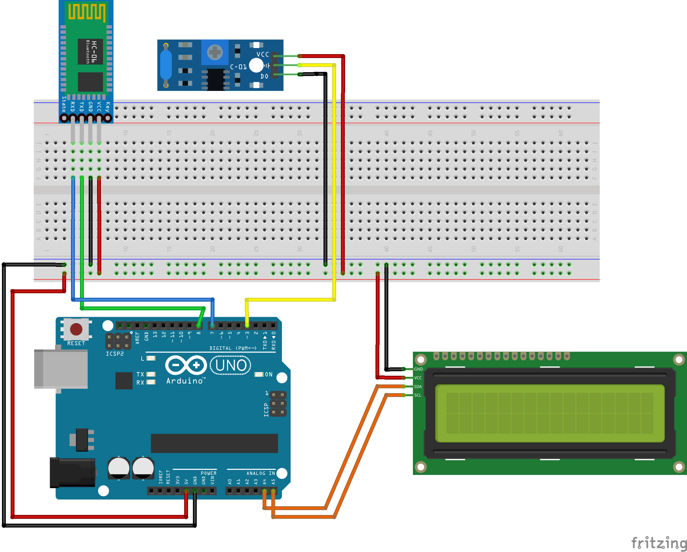

## KINGGORING 킹고링

### 설명

성균관대학교와 삼성생명이 <i>‘살수록 더 행복해지는, 웰니스 라이프’</i>를 주제로 진행한 공동 프로젝트에서 키링 기능 구현을 목적으로 작성한 아두이노 프로그램.

### 코드 실행

1. 아래 그림을 참고하여 회로를 완성한다.

2. Arduino IDE에서 `Sketch > Include Library > Manage Libraries...` 또는 `Ctrl + Shift + I`를 눌러 라이브러리 메니저 패널을 연 후 `LiquidCrystal I2C`를 설치한다.

### 회로 구성

- 아두이노 우노 Uno R3 호환 보드 CH340 ATMEGA328P
- HC-06 블루투스 모듈
- 진동 모터 모듈
- LCD I2C 1602 모듈듈

### 구현

블루투스 콘솔로 아래와 같이 문자열이 전달되면 해당 동작을 수행함.

- `ALT_BLD/`: <i>alert to measure blood sugar</i>의 줄임말. 혈당 측정 관련 동작을 수행함.

  - `ALT_BLD/ON/#`: 혈당 측정 신호로 LCD와 진동 모터를 통해 혈당 측정 시간임을 알려줌.
  - `ALT_BLD/OFF/#`: 사용자가 혈당을 측정했다는 신호로 LCD를 종료함.

- `ALT_MED/`: <i>alert the time for taking a medicine</i>의 줄임말. 인슐린을 비롯한 약 관련 동작을 수행함.

  - `ALT_MED/ON/`: 복용 시간을 알리는 신호로 LCD와 모터를 통해 사용자에게 알림.

    - `ALT_MED/ON/MED/<name>/<color>/<count>/#`: LCD에 복용해야 하는 약에 관한 정보를 보여주기 위한 arguments.
    - `ALT_MED/ON/INS/<name>/<color>/<count>/#`: LCD에 복용해야 하는 인슐린 정보를 보여주기 위한 arguments.

  - `ALT_MED/OFF/#`: 사용자가 약 복용을 완료했다는 신호로 LCD를 종료함.

### 사용 방법

1. 스토어에서 'Arduino bluetooth controller(Giumig dev)'를 설치한다.

2. 앱을 열고 블루투스에서 `HC-06`을 찾아 페어링한다.

3. 디바이스 연결 방법 중 `Terminal`로 연결하면 터미널창으로 들어갈 수 있다.

4. 위 '구현'에 나와있는 코드를 상황별로 알맞게 작성한다.
